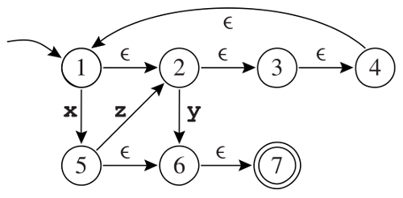

Setup
-----

Before starting this lab, please create a new directory `lab1/` in your git repository. 
Execute the following commands at the top of your repository:

```bash
$ mkdir lab1
$ cd lab1
$ wget -qO- www.sifflez.org/lectures/compil/lab1/dragon-tiger.tar.gz | tar zxv
$ git add dragon-tiger
$ git commit -m "Import dragon-tiger for lab1" dragon-tiger
$ cd dragon-tiger
```

To compile tiger language you need,

   * a Tiger compiler called `dtiger` (inside `src/driver/`)
   * a runtime library `libruntime.a` (inside `src/runtime/posix`) that implements all the Tiger primitives such as `print` or `print_int`.

You can use `dtiger` to compile a Tiger program `test.tig` as follows,

```bash
$ echo 'print("Hello World!\n")' > test.tig
$ src/driver/dtiger -o test.o test.tig
$ clang++-3.9 test.o src/runtime/posix/libruntime.a -o test
$ ./test
Hello World!
```

The second command transforms the Tiger source into an _object file_ which contains
the generated assembly code.

The third command links the _object file_ with the runtime library which contains
the implementation of Tiger primitives.

Each time you answer a question marked with [`file.ext`] you will create a new file
`lab1/dragon-tiger/file.ext` and write the answer inside (a tiger program or a regular expression).

You will then add this new file to the git, commit your changes with a
meaningful message and push your changes.

Ensure that you commit everything and follow precisely the instructions. This lab
is graded and machine corrected !

Tiger Language
--------------

We will familiarize ourselves with the Tiger language by writing a few programs. If in doubt check the [specifications of the Tiger language](https://www.lrde.epita.fr/~tiger/tiger.html)
but remember that in these lectures we will not use and implement array and record types.

(1) [`hello.tig`] Write a Tiger program, `hello.tig`, that prints the string "Hello World!" followed by a new line character to the standard output.

(2) [`fibonacci.tig`] Complete the following program and save it in a `fibonacci.tig` file.  The function `fibonacci` should return the $n^{th}$ term of the Fibonacci sequence which is defined recursively as follows,

$$ 
f_0 = 1, f_1 = 1 \\
f_{n+2} = f_{n} + f_{n+1} 
$$

```{.tiger}
let
   function fibonacci(n : int) : int =
     /* ... complete here ... */
in
   for i := 1 to 8 do
     (print_int(fibonacci(i)); print("\n"))
end
```

(3) [`read_unsigned.tig`] Complete the following program and save it in `read_unsigned.tig` file. The function `read_unsigned` reads a line from the _standard input_ (`stdin`). If the line contains only numerical characters it returns the number as a positive base-ten integer. Otherwise, it returns $-1$.

The following primitives will be useful:

* `function getchar() : string`, reads a single character from `stdin` and returns it as string of size one. If EOF is reached, the empty string is returned.
* `function ord(s : string) : int`, returns the ASCII code of the first character of the input string.

```{.tiger}
let
  /* Read a positive integer from the standard input.
     Returns -1 on error */
  function read_unsigned() : int =
    /* ... complete here ... */
  var a : int := read_unsigned()
in
  print_int(a*2);
  print("\n")
end
```

Review: Regular Expressions and Finite Automata
-----------------------------------------------

(4) Give a regular expression and an automata for each of the following languages in $\Sigma = \{a, b\}$:

* [`regexp1.txt`] words in $\Sigma^{*}$ for which the first `a` (if it exist) precedes the first `b` (if it exists).

* [`regexp2.txt`] words in $\Sigma^{*}$ for which the number of a is even (0 is considered even).

You will write regular expressions in the format accepted by `grep -E`.
The two committed files will contain nothing but the regular expression.
You can test what a regular expression matches like this:

```bash
echo "aaaaab" | grep -E -x --color "$(cat regexp2.txt)"
```

The parts of the input that match will be colored.

## Automata Determinisation

(5) What is the language accepted by the automaton in figure 1 ?
(6) Show that it is not deterministic.
(7) Determinise it.

{width=40%}
